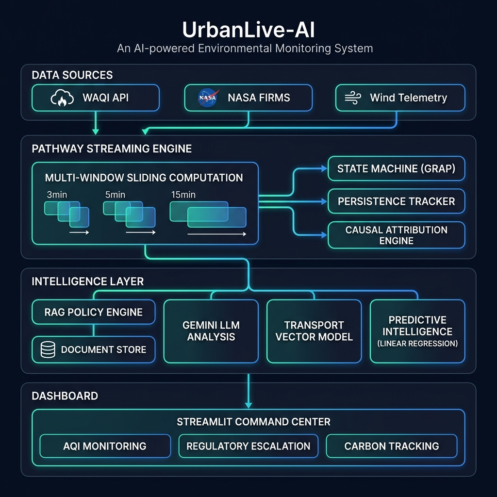
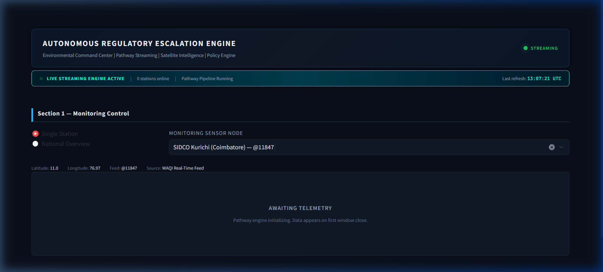
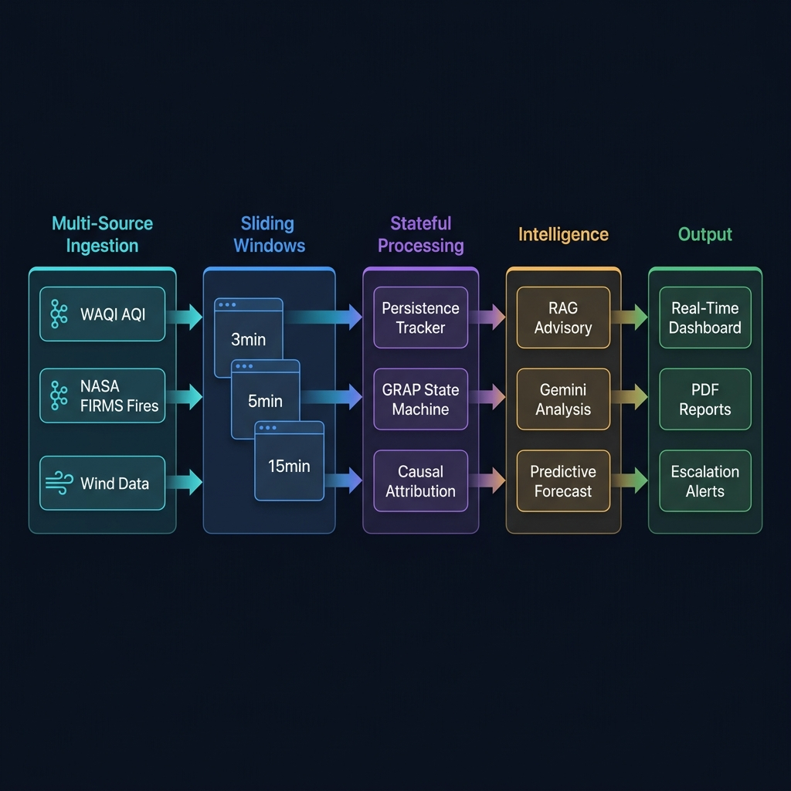
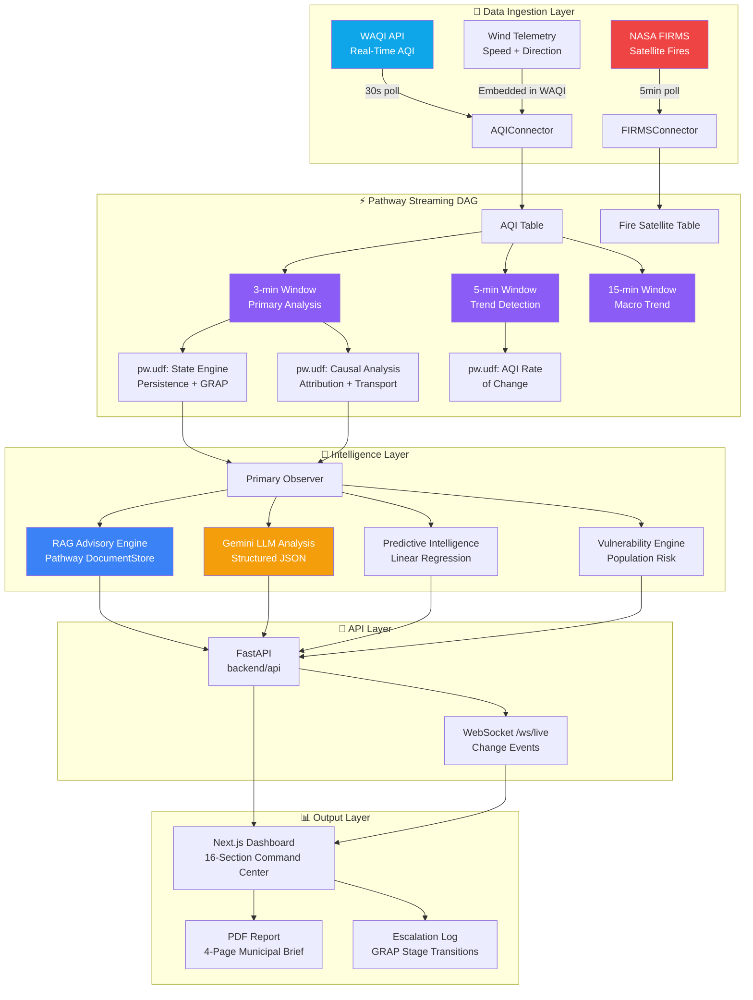
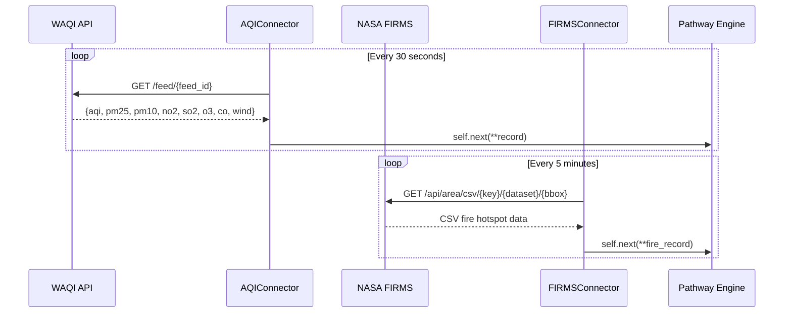
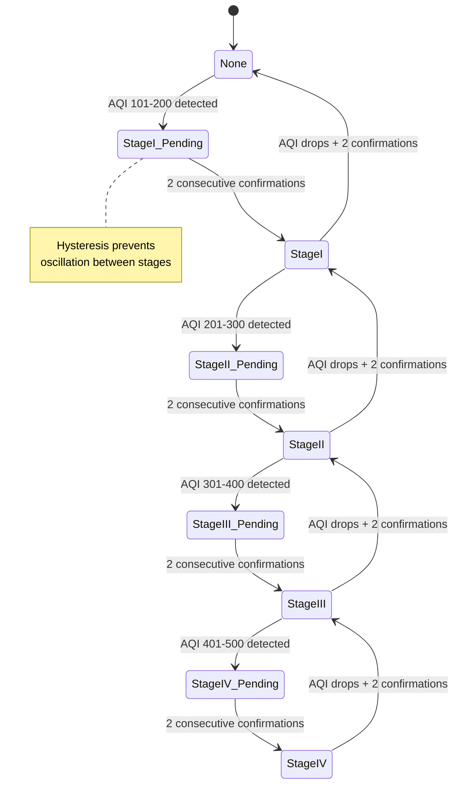
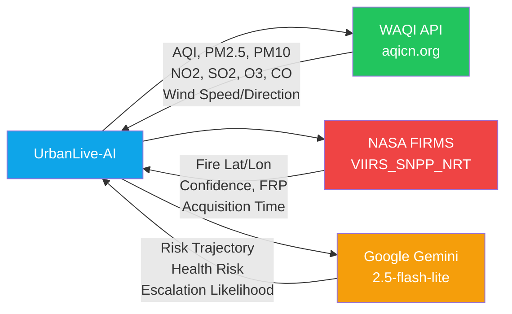

<p align="center">
  
</p>

<h1 align="center">🌍 UrbanLive-AI</h1>
<h3 align="center">Autonomous Regulatory Escalation Engine for Environmental Governance</h3>

<p align="center">
  
  
  
  
  
  
  
</p>

<p align="center">
  <i>A real-time, streaming-first environmental intelligence platform that autonomously monitors air quality across India, detects regulatory escalation triggers using India's official GRAP protocol, attributes pollution causes via satellite fire data, and generates policy-grounded advisories — all with full auditability and carbon-aware operations.</i>
</p>

---

## 📸 Dashboard Preview

<p align="center">
  
</p>

---

## 🏗️ System Architecture

<p align="center">
  
</p>

### Architecture Overview

UrbanLive-AI is built as a **Pathway-native streaming pipeline** — not a batch system running on a timer. Every data point flows through a Directed Acyclic Graph (DAG) of stateful transforms, sliding windows, and intelligence layers before reaching the operator dashboard.

Since the migration from Streamlit, the presentation layer is Next.js only:

```text
Next.js  (UI, charts, maps, forms)
   ↓  REST + WebSocket
FastAPI  (backend/api — serialization, validation, errors)
   ↓  in-process
Pathway  (streaming DAG, sliding windows, stateful transforms)
   ↓
Ingestion / Risk / RAG / Policy / AI
```

Next.js holds no business logic: every value it renders is computed by the
Python engine and served over the API.



---

## ✨ Key Features

### 🔴 Real-Time GRAP Escalation Engine
- Implements India's official **CAQM GRAP Protocol** (Graded Response Action Plan)
- **Persistence-based triggering**: Escalation only fires after `N` consecutive high-AQI sliding windows
- **Hysteresis state machine**: Prevents oscillation between stages — requires 2 confirmations before stage transition
- 4-stage regulatory escalation: `None → Stage I → Stage II → Stage III → Stage IV`

### 🛰️ Satellite Transport Intelligence
- Live integration with **NASA FIRMS VIIRS_SNPP_NRT** satellite dataset
- Per-station fire hotspot detection within configurable bounding boxes
- **Transport Vector Model**: Computes plume transport probability using fire centroids, wind vectors, and distance decay
- **Causal Attribution Engine**: Deterministic rule-based pollution source classification:
  - `crop_burning_transport` | `possible_regional_transport` | `local_accumulation` | `dust_or_construction` | `industrial_emissions` | `mixed_sources` | `background_pollution`

### 📄 RAG Policy Engine
- **Pathway DocumentStore** with live streaming re-indexing
- Per-format parsing: `.txt`/`.md` decoded as UTF-8, `.pdf` via `pypdf`,
  `.docx` via `python-docx` — unparseable files are reported, not skipped silently
- Automatically ingests policy documents from `policies/` folder (TXT, PDF, DOCX)
- Embedded vector index using `all-MiniLM-L6-v2` (384-dim)
- `BruteForceKnnFactory` for real-time similarity retrieval
- Generates **policy-grounded advisories** referencing actual GRAP schedules and CPCB guidelines

### 🤖 AI Risk Interpretation (Gemini)
- Structured JSON output from `gemini-3.5-flash-lite` (override with `GEMINI_MODEL`)
- Risk trajectory, escalation likelihood, public health risk assessment
- **Explanation-only**: LLM does NOT influence escalation decisions
- 10-second per-station cooldown with deterministic fallback on rate-limiting

### 📈 Predictive Intelligence
- **5-min and 30-min AQI projections** via linear regression on sliding windows
- Z-score anomaly detection (>2σ deviation triggers alert)
- Escalation ETA computation
- AQI rate-of-change tracking across multiple window sizes

### 👥 Vulnerable Population Risk Engine (VPPE)
- Risk multipliers for: General (1.0×), Elderly (1.4×), Children (1.6×), Respiratory (1.8×)
- Pre-emptive public health advisory generation
- Deterministic — no ML models, fully auditable

### 🌱 Carbon-Aware Operations
- Real-time carbon footprint tracking via **CodeCarbon**
- Per-decision emissions computation (gCO₂eq)
- Deterministic fallback when hardware sensors unavailable

### 📋 PDF Report Generator
- 4-page municipal governance report via **ReportLab**
- Decision snapshot, risk outlook, satellite attribution, engine transparency
- **Zero generative content** — all deterministic values from live state

---

## 📁 Project Structure

```
urbanlive-ai/
│
├── 📂 backend/                    # Python engine + API (unchanged intelligence)
│   ├── 📄 app.py                  # Pathway streaming pipeline & DAG
│   ├── 📄 config.py               # Central configuration & thresholds
│   ├── 📄 station_loader.py       # Dynamic pan-India station discovery (WAQI API)
│   ├── 📄 report_generator.py     # PDF escalation report (ReportLab)
│   ├── 📄 requirements.txt        # Python dependencies
│   │
│   ├── 📂 api/                    # FastAPI layer (presentation only)
│   │   ├── main.py                # App, CORS, error handling, health
│   │   ├── engine.py              # Bridge to the live engine state
│   │   ├── schemas.py             # Pydantic response models
│   │   ├── serialization.py       # JSON-safe conversion of engine state
│   │   ├── deps.py                # Shared request guards (503/425/404)
│   │   ├── ws.py                  # WebSocket live event channel
│   │   └── 📂 routes/             # dashboard, stations, aqi, risk, grap,
│   │                              # forecast, advisory, ai, carbon,
│   │                              # escalations, policy, reports, system
│   │
│   ├── 📂 ingestion/              # Multi-source data ingestion
│   │   ├── aqi_stream.py          # WAQI AQI polling with retry & staleness
│   │   ├── fire_stream.py         # Legacy fire count (FIRMS)
│   │   └── firms_stream.py        # Per-station satellite fire intelligence
│   │
│   ├── 📂 streaming/              # Stateful streaming computation
│   │   ├── state_machine.py       # GRAP state machine + persistence tracker
│   │   └── risk_engine.py         # Causal attribution + transport vector model
│   │
│   ├── 📂 rag/                    # Policy retrieval & LLM layer
│   │   ├── advisory_engine.py     # RAG: Pathway DocumentStore + policy grounding
│   │   └── llm_engine.py          # Gemini structured risk interpretation
│   │
│   └── 📂 policies/               # Policy documents (auto-indexed by RAG)
│
├── 📂 frontend/                   # Next.js + TypeScript + Tailwind dashboard
│   ├── 📂 src/app/                # Routes: /, /dashboard, /stations/[station], /reports
│   ├── 📂 src/components/         # AQICard, GRAPCard, SatelliteCard, StationMap, …
│   ├── 📂 src/hooks/              # usePolling, useLiveChannel, useEngineConfig
│   ├── 📂 src/lib/                # api.ts (all API calls), theme.ts (AREE palette)
│   ├── 📂 src/types/              # TypeScript mirrors of the API schemas
│   └── 📄 .env.local              # NEXT_PUBLIC_API_URL
│
├── 📄 Dockerfile                  # Backend container (Cloud Run ready)
├── 📄 docker-compose.yml          # Backend + frontend together
├── 📄 .env                        # API keys (WAQI, FIRMS, Gemini) — backend only
└── 📄 .gitignore
```

---

## 🧠 How It Works — Deep Dive

### 1. Multi-Source Data Ingestion



The ingestion layer uses **Pathway ConnectorSubjects** — custom Python classes that emit records into Pathway tables as an infinite streaming source. Each connector runs in its own thread with configurable poll intervals.

### 2. Multi-Window Sliding Computation

The engine runs **three parallel sliding windows** on every incoming AQI data point:

| Window | Duration | Hop | Purpose |
|--------|----------|-----|---------|
| **Primary** | 3 minutes | 1 minute | GRAP state transitions & persistence |
| **5-min** | 5 minutes | 1 minute | AQI rate-of-change & trend detection |
| **15-min** | 15 minutes | 1 minute | Macro trend & background drift |

Each window produces enriched aggregates (`max_aqi`, `avg_aqi`, `min_aqi`, `wind_speed`, etc.) that feed into downstream stateful transforms via `pw.udf` functions.

### 3. GRAP State Machine



The GRAP state machine implements **hysteresis-based transitions** — a stage change only takes effect after `HYSTERESIS_CONFIRMATIONS` (default: 2) consecutive windows confirm the new stage. This prevents rapid oscillation during boundary conditions (e.g., AQI fluctuating around 200).

### 4. Transport Vector Model

The satellite transport analysis pipeline:

```
Fire Hotspots → FRP-Weighted Centroid → Bearing Calculation → Wind Alignment
                                                                    ↓
Station Location ← Haversine Distance ← Distance Decay Factor ← Transport Probability
                                                                    ↓
                                                        Combined Score (0-100)
                                                        alignment × 0.35 + distance × 0.25
                                                        + wind × 0.20 + fire_intensity × 0.20
```

### 5. Escalation Readiness Index (ERI)

A composite advisory index (0-100) computed deterministically:

| Factor | Points | Condition |
|--------|--------|-----------|
| High AQI | +40 | AQI ≥ 200 |
| Rising Slope | +20 | Slope > 0.5 AQI/min |
| Persistence | +20 | ≥ 1 consecutive high window |
| Transport | +10 | Transport score > 50 |
| Exposure | +10 | 30-min exposure score > 150 |

**ERI Categories**: LOW READINESS (0-25) → MONITOR (26-50) → PRE-ESCALATION (51-75) → HIGH READINESS (76-100)

> ⚠️ ERI is **advisory only** — it does NOT influence the GRAP escalation trigger logic.

---

## 🚀 Quick Start

### Prerequisites

- **Docker** (recommended) or **Linux/WSL** with Python 3.10+
- API Keys:
  - [WAQI API Token](https://aqicn.org/data-platform/token/)
  - [NASA FIRMS API Key](https://firms.modaps.eosdis.nasa.gov/api/area/)
  - [Google Gemini API Key](https://aistudio.google.com/apikey)

> **Pathway publishes Linux/macOS wheels only.** On Windows the API still starts,
> but every data route answers `503 engine_unavailable` until you run the backend
> under WSL or Docker. The frontend runs natively on any platform.

### Option 1: Docker Compose (backend + frontend)

```bash
# Configure API keys in .env at the project root:
#   WAQI_TOKEN=your_waqi_token
#   FIRMS_API_KEY=your_firms_key
#   GEMINI_API_KEY=your_gemini_key

docker compose up --build

# Backend  → http://localhost:8000/docs
# Frontend → http://localhost:3000
```

### Option 2: Backend in Docker, frontend local

```bash
# Backend (Pathway engine + FastAPI)
docker build -t aree-backend .
docker run -p 8000:8000 --env-file .env -e PORT=8000 aree-backend

# Frontend
cd frontend
npm install
npm run dev
# → http://localhost:3000
```

### Option 3: Local (Linux/WSL)

```bash
# Backend
python3.10 -m venv venv
source venv/bin/activate
pip install -r backend/requirements.txt
uvicorn backend.api.main:api --reload --port 8000
# → http://localhost:8000/api/health  and  http://localhost:8000/docs

# Frontend (separate terminal)
cd frontend
npm install
npm run dev
# → http://localhost:3000
```

### Streamlit dashboard (removed)

The original Streamlit presentation layer has been **removed** now that the
migration is complete. Next.js is the only frontend; `streamlit` and
`streamlit-autorefresh` are no longer dependencies.

The intelligence engine was never part of that layer and is unchanged — Pathway,
ingestion, the risk engine, the GRAP state machine, RAG, Gemini and PDF
generation all live in `backend/` exactly as before. A pre-migration copy of the
old dashboard is retained under `backup_pre_migration/` for reference only; it is
not part of the build and nothing imports it.

---

## ⚙️ Configuration

All operational parameters are centralized in [`config.py`](config.py):

| Parameter | Default | Description |
|-----------|---------|-------------|
| `AQI_POLL_INTERVAL` | 30s | WAQI polling frequency |
| `FIRE_POLL_INTERVAL` | 60s | FIRMS polling frequency |
| `PERSISTENCE_THRESHOLD` | 3 | Consecutive windows for escalation |
| `HIGH_AQI_THRESHOLD` | 300 | AQI level triggering escalation watch |
| `WINDOW_DURATION_MINUTES` | 3 | Primary sliding window size |
| `WINDOW_HOP_MINUTES` | 1 | Window hop interval |
| `HYSTERESIS_CONFIRMATIONS` | 2 | Required confirmations for stage change |
| `FIRMS_BBOX_DELTA` | 0.15° | Satellite search radius per station |
| `STALE_DATA_THRESHOLD_SECONDS` | 1200 | Data staleness warning (20 min) |
| `GEMINI_MODEL` | `gemini-3.5-flash-lite` | LLM model id (env override) |
| `GEMINI_MAX_TOKENS` | 1024 | Reply budget — too low truncates the JSON |

### Monitoring Stations

The system ships with 5 verified CPCB stations and dynamically discovers up to **30 additional stations** across India via the WAQI search API:

| Station | City | Feed ID |
|---------|------|---------|
| SIDCO Kurichi | Coimbatore | @11847 |
| BTM Layout | Bangalore | @8190 |
| Tirumala | Tirupati | @9069 |
| NSIT Dwarka | Delhi | A568246 |
| Anand Vihar | Delhi | @2553 |

---

## 📊 Dashboard Sections

The Next.js command center preserves all **16 operational sections** from the
original dashboard, across four routes:

| Route | Contents |
|-------|----------|
| `/` | National overview: live map, Top-5 AQI/ERI, cross-station rankings, escalations, carbon |
| `/dashboard?station=…` | Single-station command center with inline selector |
| `/stations/[station]` | The same command center, deep-linkable |
| `/reports` | Per-station PDF escalation report downloads |

Section-by-section (identical numbering in both UIs):

| # | Section | Description |
|---|---------|-------------|
| 1 | Monitoring Control | Station selection + National Overview mode |
| 2 | Data Source Transparency | WAQI feed ID, raw AQI, timestamp, freshness |
| 3 | Official Regulatory Context | Engine mode, data type, API response time |
| 4 | Persistence Engine Status | Escalation state, consecutive windows, progress |
| 5 | Satellite Transport Intelligence | Fire hotspots, transport score, wind data |
| 6 | Data Methodology | How AQI is used, what triggers escalation |
| 7 | Regulatory Advisory | Full grounded advisory with legal basis |
| 8 | Policy Retrieval Intelligence | RAG index stats, source document, similarity |
| 9 | Escalation History | Log of all GRAP stage transitions |
| 10 | Carbon Intensity | Total emissions, per-decision cost |
| 11 | Predictive Intelligence | Trend, 5-min/30-min projections, anomaly |
| 12 | Escalation Readiness Index | ERI score with contributing factors |
| 13 | Ward Comparative Ranking | Cross-station AQI, ERI, slope rankings |
| 14 | AI Risk Interpretation | Gemini structured analysis |
| 15 | Public Health Impact Forecast | VPPE risk matrix, pre-emptive advisory |
| 16 | Policy Intelligence Console | Live index, document upload, PDF export |

---

## 🔌 AREE REST API

The FastAPI layer exposes the live engine state. It contains **no business
logic** — every value comes from the running Pathway pipeline, RAG index or
report generator. Interactive docs: `http://localhost:8000/docs`.

| Method | Endpoint | Returns |
|--------|----------|---------|
| GET | `/api/health` | Liveness + engine load state (always answers) |
| GET | `/api/system/status` | Pipeline status, active stations, decisions processed |
| GET | `/api/system/config` | Thresholds, window params, CPCB bands, GRAP stages |
| GET | `/api/dashboard` | National overview: map points, top-5 lists, rankings |
| GET | `/api/stations` | All known nodes with headline live state |
| GET | `/api/stations/{station}` | Complete engine state for one station |
| GET | `/api/aqi/{station}` | AQI, pollutants, feed provenance, freshness |
| GET | `/api/aqi/{station}/history` | Rolling sliding-window AQI history |
| GET | `/api/grap/{station}` | GRAP stage, persistence, hysteresis, decision trace |
| GET | `/api/risk/{station}` | ERI, transport score, causal attribution |
| GET | `/api/forecast/{station}` | 5/30-min projection, slope, anomaly, history |
| GET | `/api/forecast/{station}/health` | VPPE vulnerable-population risk matrix |
| GET | `/api/advisory/{station}` | Grounded advisory text + RAG metadata |
| GET | `/api/ai/{station}` | Gemini structured risk interpretation |
| GET | `/api/carbon` | Carbon accounting for the engine |
| GET | `/api/escalations` | GRAP stage transition log (`?station=` to filter) |
| GET | `/api/policy` | Live policy index status + indexed documents |
| POST | `/api/policy/upload` | Upload a policy doc into the RAG index (multipart) |
| GET | `/api/reports/{station}` | Report availability + download link |
| GET | `/api/reports/{station}/pdf` | The 4-page municipal PDF report |
| WS | `/ws/live` | Change events: `station_update`, `escalation`, `status` |

### Error contract

All errors return structured JSON, never an HTML page:

```json
{
  "error": "engine_starting",
  "detail": "AREE engine is starting: loading the Pathway pipeline…",
  "status_code": 503,
  "hint": "Retry in a few seconds. Poll GET /api/health for readiness."
}
```

| Status | Meaning |
|--------|---------|
| `424` | Upstream WAQI feed is dormant (`no_aqi`) or failing (`feed_error`) |
| `425` | Station known, but no sliding window has closed yet |
| `422` | Upstream payload failed validation (`DATA_INVALID`) |
| `503` | Engine still starting, or not runnable in this environment |

A station whose feed publishes no aggregate AQI (WAQI returns `"-"`) is reported
distinctly rather than looking like one that is merely warming up:
`GET /api/stations` carries `feed_status`, `feed_error` and `feed_last_reading`
per station plus an `unavailable` count.

### Live updates

REST is the data path; the WebSocket only announces change. The frontend polls
every 5s and additionally refetches immediately when `/ws/live` reports a
`station_update` or `escalation`. If the socket never connects, the dashboard
keeps working on polling alone and shows `polling only`.

---

## 🔗 API Integrations



| API | Purpose | Rate | Auth |
|-----|---------|------|------|
| **WAQI** | Real-time AQI + pollutant data | 30s/station | Token |
| **NASA FIRMS** | Satellite fire detection (VIIRS) | 5min/station | API Key |
| **Google Gemini** | AI risk interpretation | 10s cooldown | API Key |

---

## 🐳 Deployment

### Cloud Run (GCP)

```bash
# Build container
docker build -t gcr.io/PROJECT_ID/urbanlive-ai .

# Push to Container Registry
docker push gcr.io/PROJECT_ID/urbanlive-ai

# Deploy
gcloud run deploy urbanlive-ai \
  --image gcr.io/PROJECT_ID/urbanlive-ai \
  --platform managed \
  --port 8080 \
  --set-env-vars "WAQI_TOKEN=xxx,FIRMS_API_KEY=xxx,GEMINI_API_KEY=xxx" \
  --memory 2Gi
```

### Docker Compose

```yaml
version: "3.8"
services:
  urbanlive-ai:
    build: .
    ports:
      - "8080:8080"
    env_file:
      - .env
    volumes:
      - ./policies:/app/policies
    restart: unless-stopped
```

---

## 🧪 Design Principles

1. **Streaming-First**: Pathway DAG processes every data point through stateful transforms — no batch scheduling.
2. **Deterministic Decisions**: All escalation logic is rule-based and auditable. LLM is explanation-only.
3. **Data Sovereignty**: WAQI AQI used directly from API payload. No re-computation or approximation.
4. **Graceful Degradation**: Each subsystem (FIRMS, Gemini, RAG) fails independently with deterministic fallbacks.
5. **Full Transparency**: Every dashboard panel shows data provenance — feed ID, timestamp, freshness, confidence score.
6. **Carbon Awareness**: Per-decision emissions tracked and displayed.
7. **Zero-Config Dynamic Discovery**: Stations auto-discovered from WAQI search API (up to 30 across India).

---

## 🛡️ How Escalation Logic Works

```
IF   AQI ≥ 300  (from WAQI API, direct — no recomputation)
AND  Sustained across 3 consecutive sliding windows (3min duration, 1min hop)
AND  GRAP state machine confirms via 2 hysteresis confirmations
THEN → ESCALATION TRIGGERED

Regulatory actions activated:
  ▸ Construction/demolition restrictions
  ▸ High-emission vehicle entry ban
  ▸ Industrial compliance verification
  ▸ Public health advisory issuance
  ▸ School outdoor activity suspension
```

> The system never modifies or re-calculates the AQI. It uses the exact value from the WAQI payload.

---

## 📜 Policy Documents

The RAG engine automatically indexes documents placed in the `policies/` directory:

| Document | Description | Size |
|----------|-------------|------|
| `GRAP Schedule.txt` | Official CAQM GRAP action framework | 25 KB |
| `hspcb_winter_action_plan.txt` | Haryana SPCB winter action plan 2024-25 | 84 KB |
| `How_AQI_Calculated.txt` | AQI computation methodology | 1.3 KB |
| `pollution.txt` | Comprehensive pollution reference | 63 KB |

**To add new policy documents**: Simply place `.txt` or `.pdf` files in the `policies/` folder — the Pathway DocumentStore will auto-index them in real-time.

---

## 📄 License

This project is built for the **Hack for Green Bharat** hackathon. See the problem statement in `policies/` for context.

---

## 🙏 Acknowledgments

- **[WAQI](https://aqicn.org/)** — Real-time global air quality data
- **[NASA FIRMS](https://firms.modaps.eosdis.nasa.gov/)** — Satellite-based fire detection
- **[Pathway](https://pathway.com/)** — Real-time streaming data processing
- **[Google Gemini](https://ai.google.dev/)** — AI-powered risk interpretation
- **[CodeCarbon](https://codecarbon.io/)** — Carbon emissions tracking

---

<p align="center">
  <sub>Built with 💚 for cleaner air and smarter governance</sub>
</p>

docker compose up --build